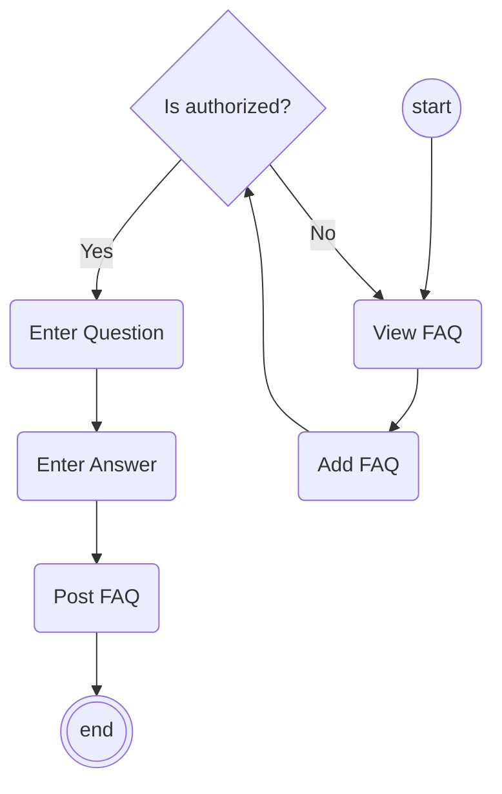
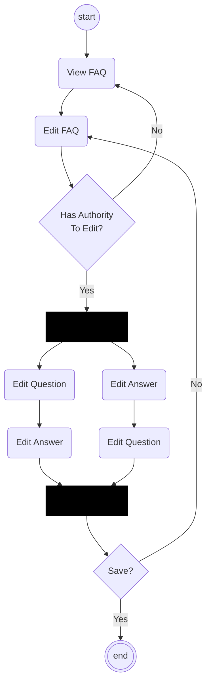
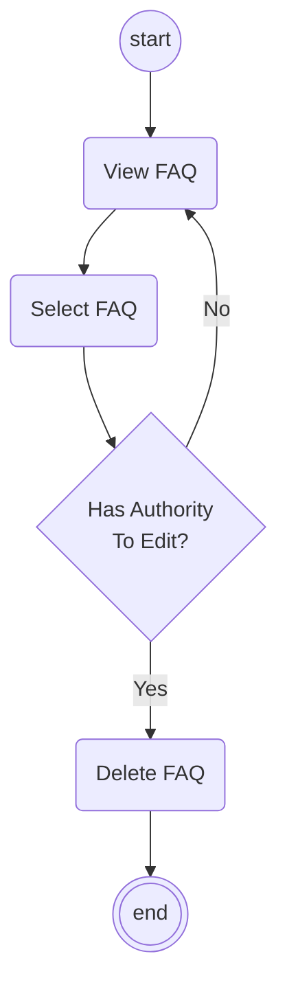
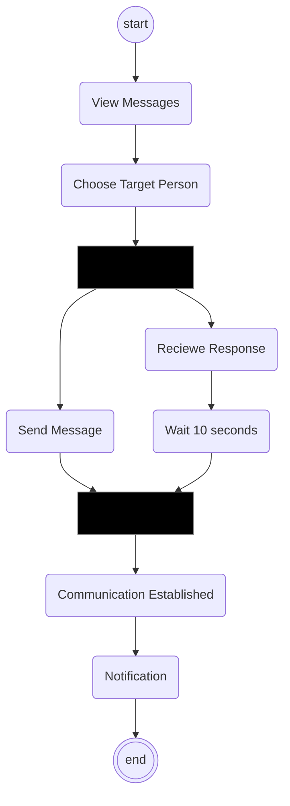
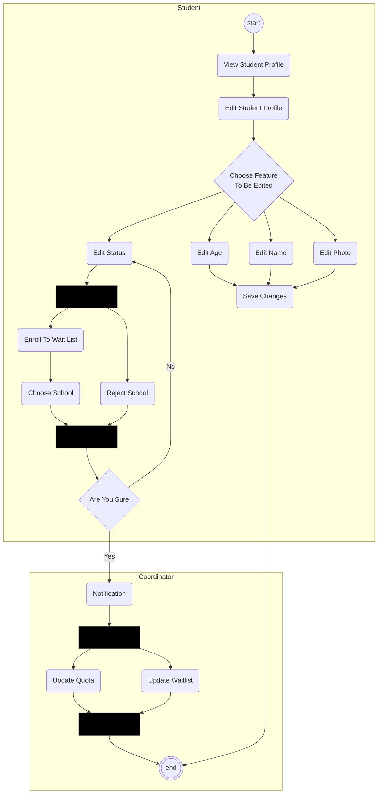
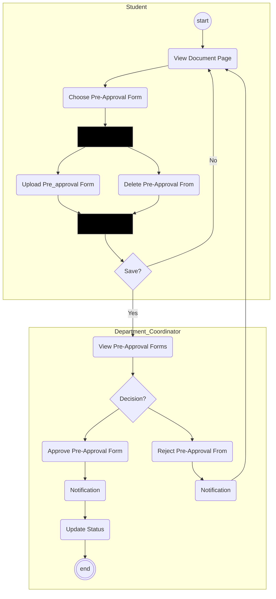
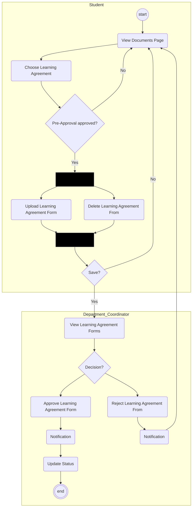
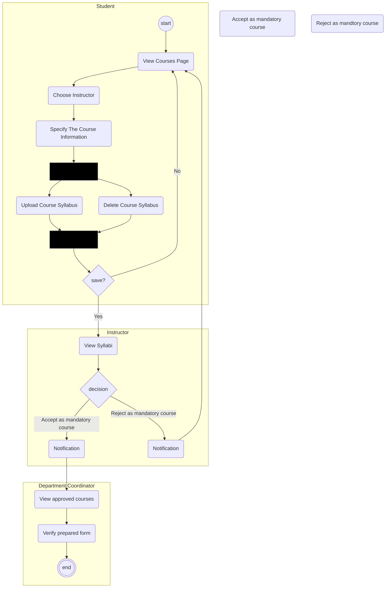
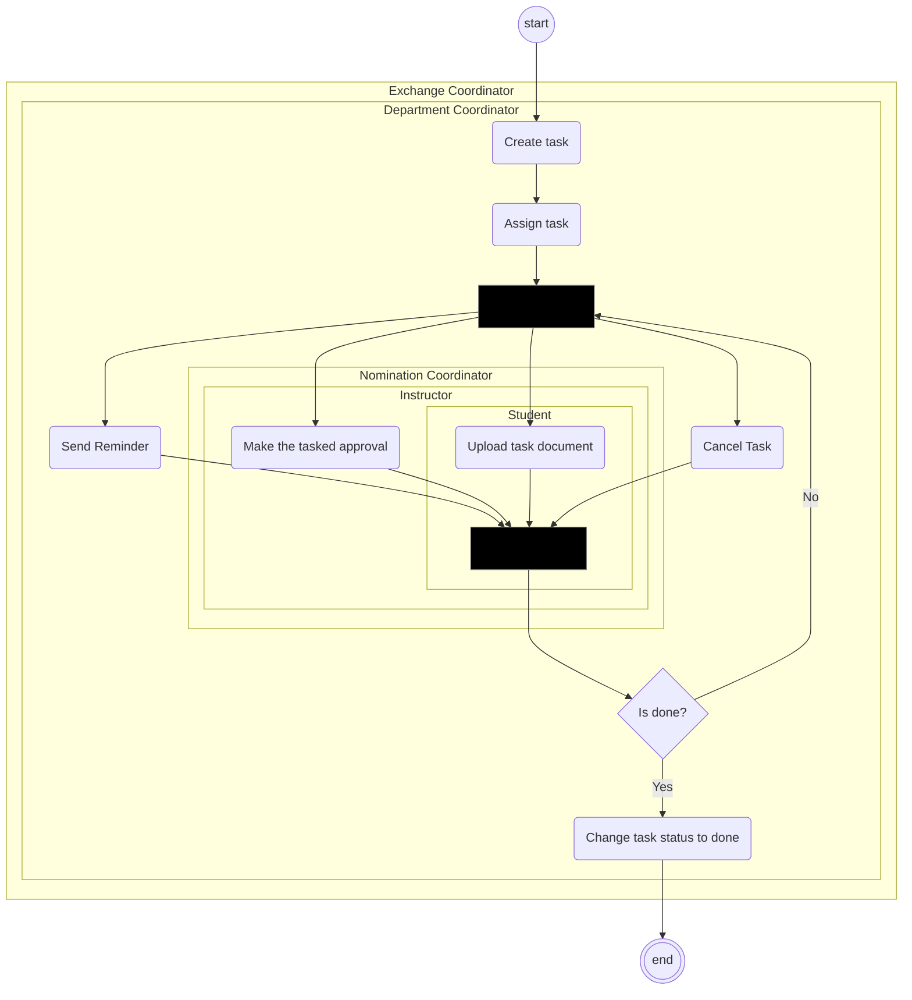

# ACTIVITY DIAGRAMS
## Table of contents
1. [FAQ Related Diagrams](#faq)
    1. [Adding](#adding)
    2. [Editing](#editing)
    3. [Deleting](#deleting)
2. [Sending & Receiving Messages](#messages)
3. [Editing Student Profiles](#profiles)
4. [Pre Approval Forms](#forms)
5. [Learning Agreements](#learning)
6. [Course Agreement](#course)
6. [Tasks](#tasks)

## FAQ Related Diagrams 
### Activity Diagram Of Adding FAQ  

### Activity Diagram Of Editing FAQ 

### Activity Diagram Of Deleting FAQ 

## Activity Diagram For Sending & Receiving Messages 

## Activity Diagram For Editing Student Profiles 

## Activity Diagram For Pre Approval Forms  

## Activity Diagram For Learning Agreements   

## Activity Diagram For Courses  //TODO

## Activity Diagram For Tasks  

