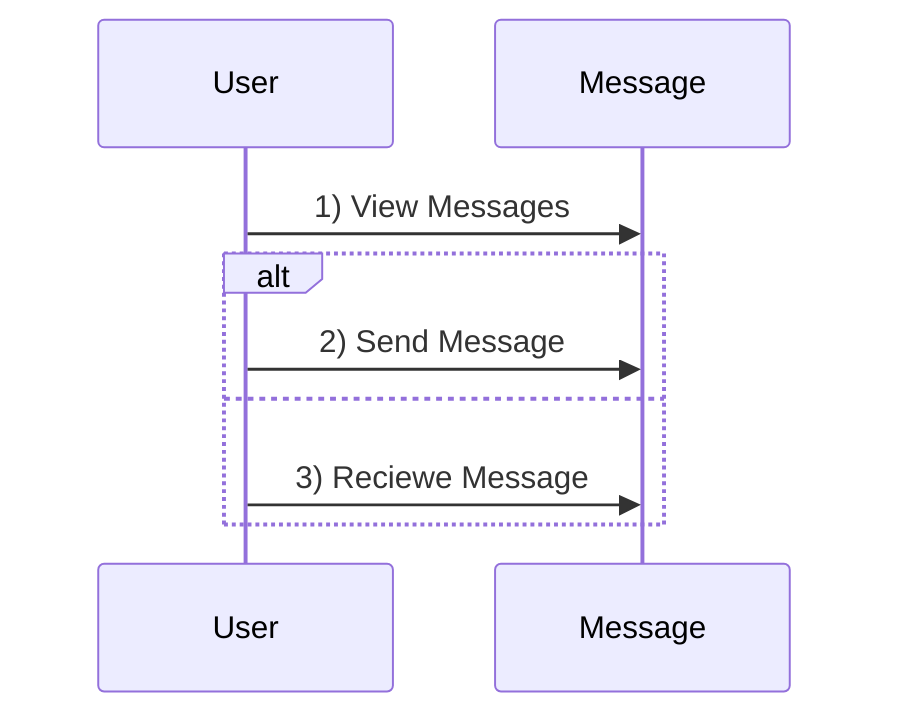
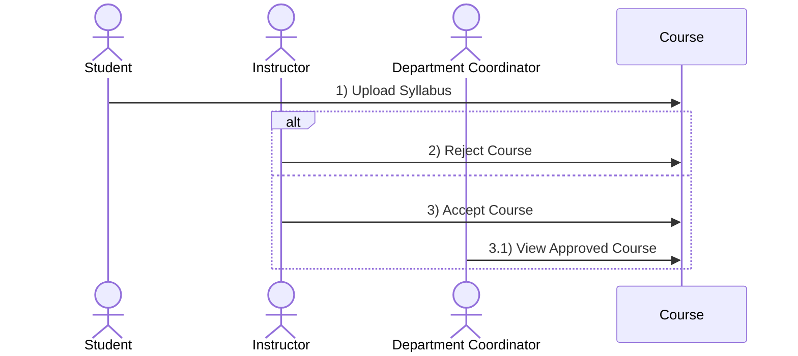
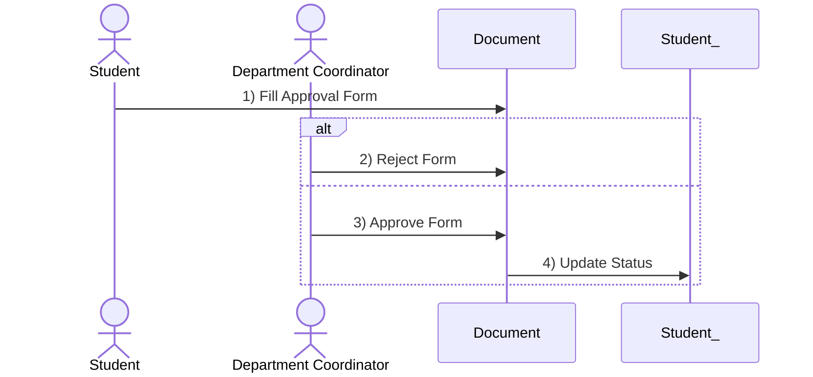
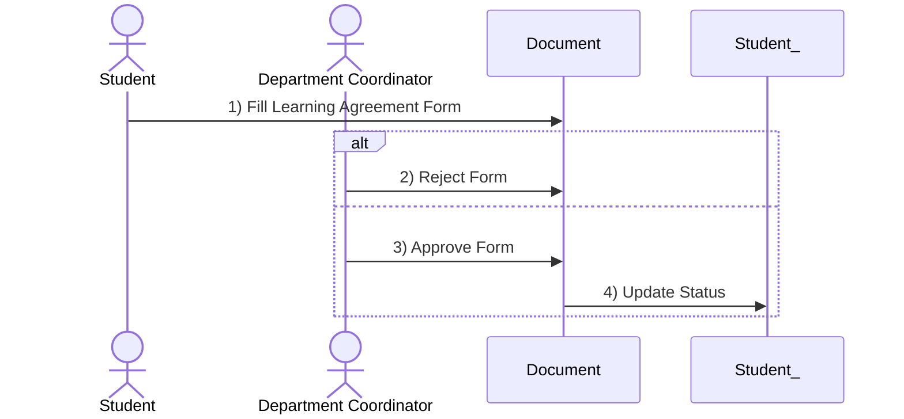
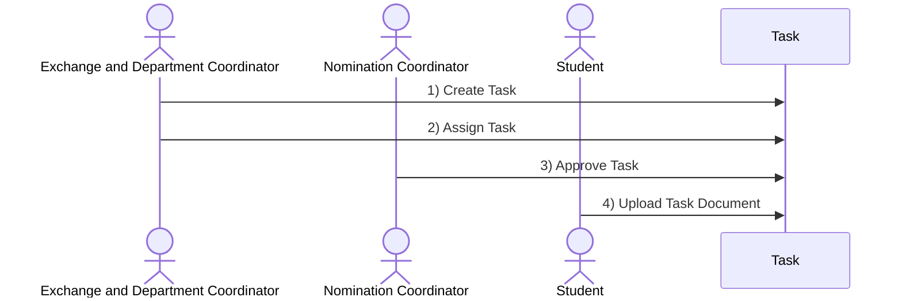
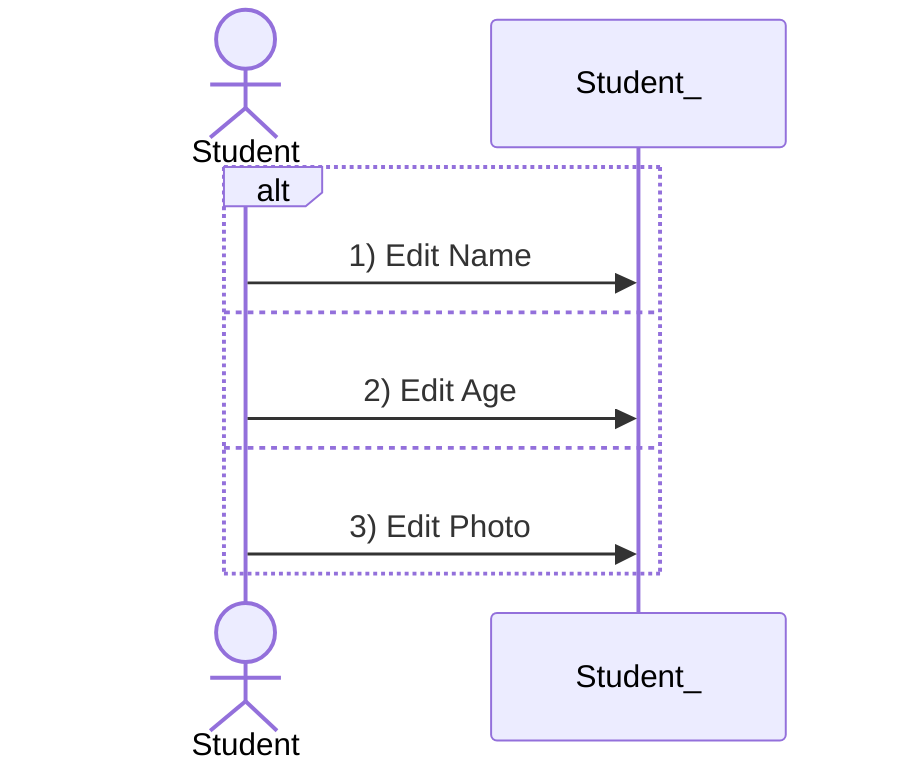
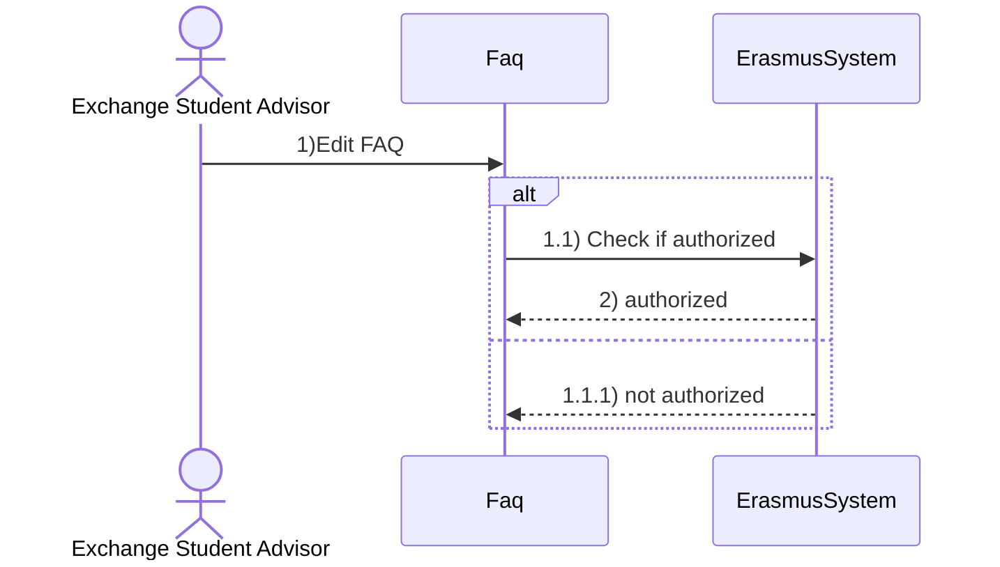
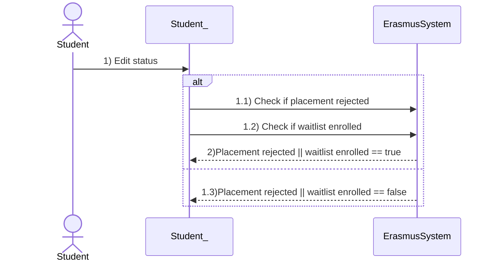

# Sequence Diagrams

## Table Of Contents
1. [Send Message](#send)
2. [Accept Reject Mandatory Course](#armc)
3. [Approve Reject Pre-Approval Form](#arpf)
4. [Approve Reject Learning Agreemnet Form](#arlaf)
5. [Upload Task Document](#utd)
6. [Edit Student Profile](#esp)
7. [Edit FAQ](#ef)

## Send Message 

## Accept Reject Mandatory Course 

## Approve / Reject Preapproval Form 

## Approve / Reject Learning Agreement 

## Upload Task Document 

## Edit Student Profile 

