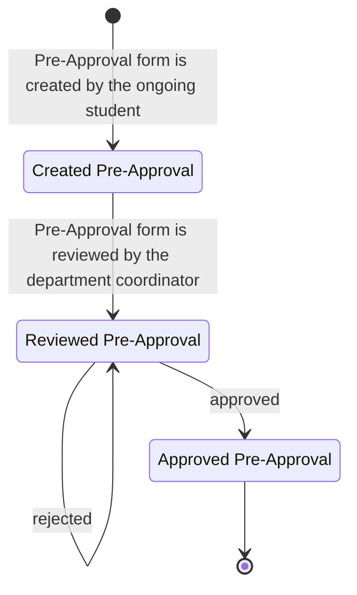
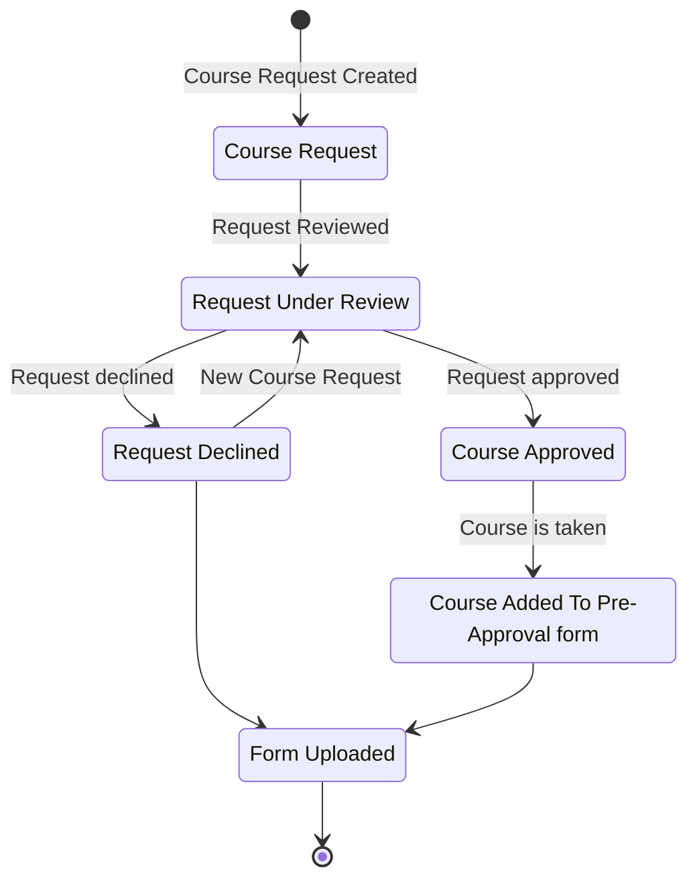
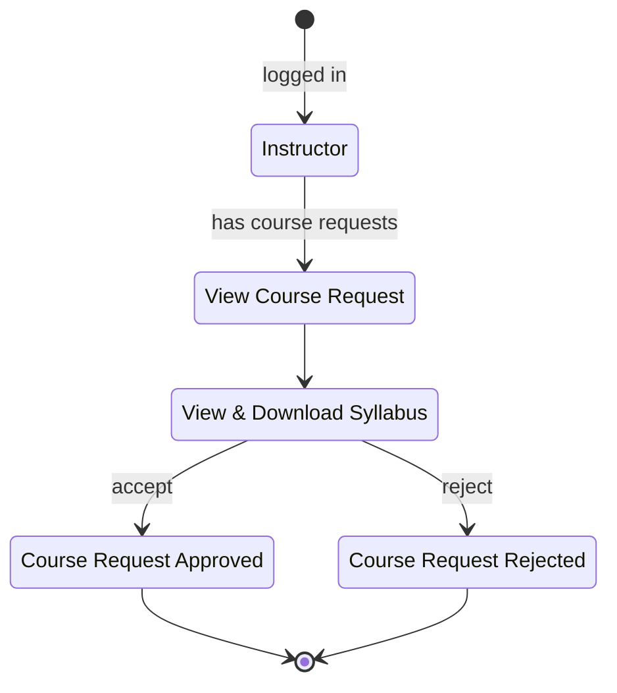
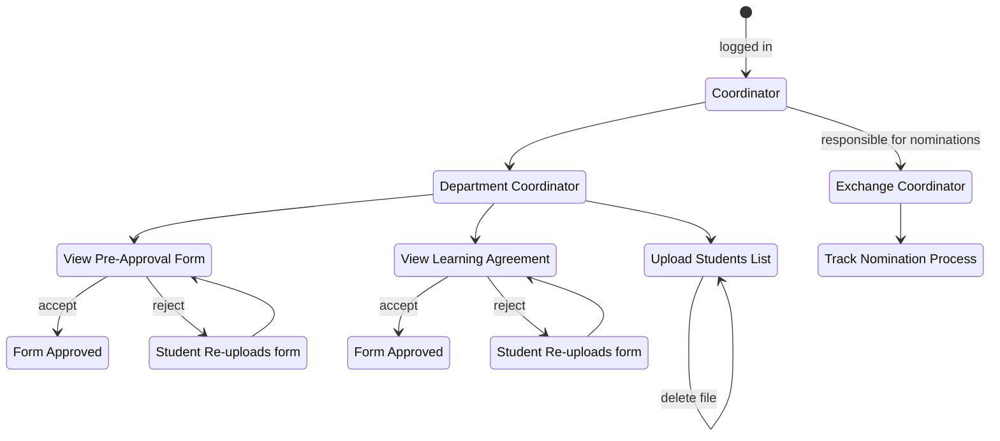
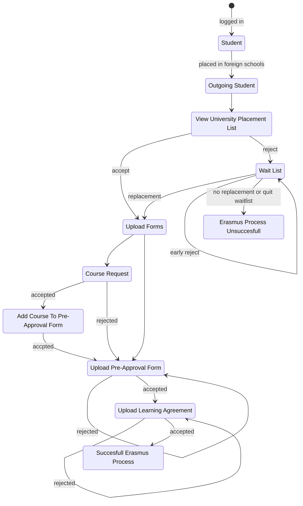

# State Diagrams

## Table Of Contents
1. [Pre-Approval](#pre)
2. [Course Request](#course)
3. [Instructor](#instructor)
4. [Coordinator](#coordinator)
4. [Student](#student)

## Pre-Approval Form 

## Course Request 

## Instructor Roles 

## Coordinators 

## Student 

